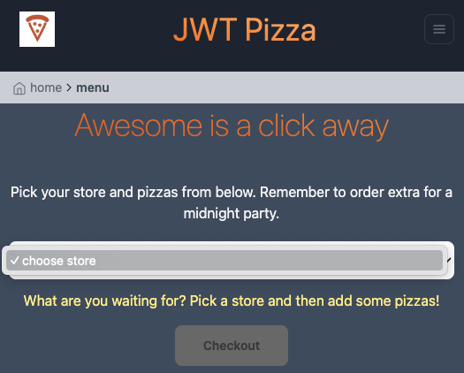
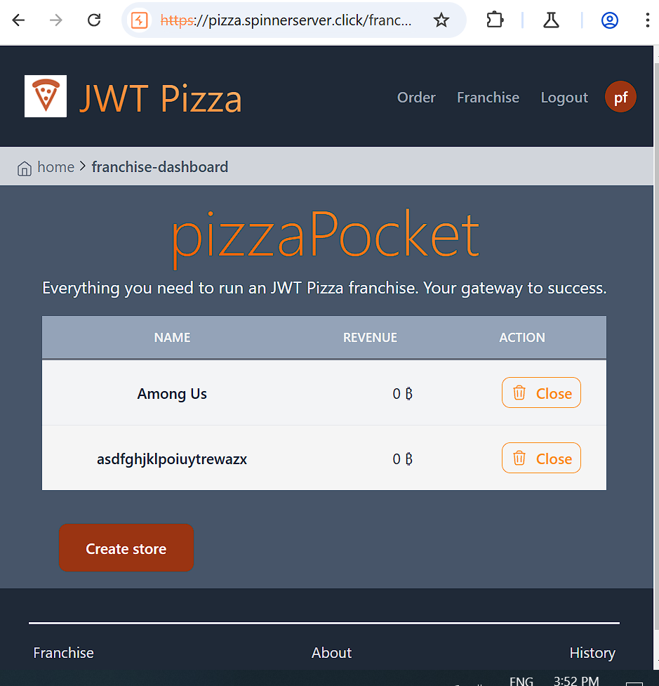

### Peer Names
1. Alex Burgess
2. Eric Leech

### Alex Burgess Self Attacks

### Eric Leech Self Attacks
Self-attack 1
| Item           | Result                                                                         |
| -------------- | ------------------------------------------------------------------------------ |
| Date           | Dec 7, 2024                                                                    |
| Target         | pizza.windypit.com                                                             |
| Classification | Security misconfiguration                                                      |
| Severity       | 1                                                                              |
| Description    | Default user accounts listed in public documentation.                          |
| Images         |    Stores and menu no longer accessible. |
| Corrections    | Remove default accounts                                                        |

Self-attack 2
| Item           | Result                                                                         |
| -------------- | ------------------------------------------------------------------------------ |
| Date           | Dec 7, 2024                                                                    |
| Target         | pizza.windypit.com                                                             |
| Classification | Broken access control                                                          |
| Severity       | 4                                                                              |
| Description    | Attempt to delete franchise data.                                              |
| Images         |    Stores no longer accessible.          |
| Corrections    | Fix missing authentication check in franchise endpoint                         |

Self-attack 3
| Item           | Result                                                                         |
| -------------- | ------------------------------------------------------------------------------ |
| Date           | Dec 9, 2024                                                                    |
| Target         | pizza.windypit.com                                                             |
| Classification | Injection                                                                      |
| Severity       | 4                                                                              |
| Description    | Attempt to inject data into the database via SQL.                              |
| Images         | No result                                                                      |
| Corrections    | Sanitize user inputs anyways                                                   |

### Alex's attacks on Eric

### Eric's attacks on Alex
Peer attack 1

| Item           | Result                                                                         |
| -------------- | ------------------------------------------------------------------------------ |
| Date           | Dec 10, 2024                                                                   |
| Target         | pizza.spinnerserver.click                                                      |
| Classification | Security Misconfiguration                                                      |
| Severity       | 3                                                                              |
| Description    | Attempt to inject data into the database via SQL.                              |
| Images         |    Stores                         |
| Corrections    | Remove default accounts                                                        |

Peer attack 2
| Item           | Result                                                                         |
| -------------- | ------------------------------------------------------------------------------ |
| Date           | Dec 9, 2024                                                                    |
| Target         | pizza.windypit.com                                                             |
| Classification | Injection                                                                      |
| Severity       | 4                                                                              |
| Description    | Attempt to inject data into the database via SQL.                              |
| Images         | No result                                                                      |
| Corrections    | Sanitize user inputs anyways                                                   |

### Combined Summary
Together, we learned that security is more difficult than it seems. Having a secure program means having security measures in every aspect, and the most secure program will be built from the ground up with those measures in mind. And even that program may have exploitable holes, despite our best efforts, so we should be constantly improving our efforts to protect important data. 

It was difficult to find an exploit with our level of skill, despite knowing they exist. That was both heartening and disheartening- good to know there was some basic security already in place, bad that we managed to still find exploits regardless. That is a lesson to keep in mind: we need to be vigilant and be able to rely on others for things we cannot see ourselves.